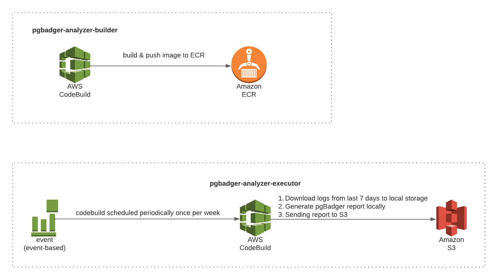

# aws-pgbadger-analyzer
#### Name:
Containerized version of the [pgBadger](https://github.com/darold/pgbadger) prepared on [AWS CodeBuild](https://aws.amazon.com/codebuild/). With CodeBuild, you don’t need to provision, manage, and scale your own build servers. Thanks to this our reports can be generated periodically in fully on-demand environments. 
#### Design:
